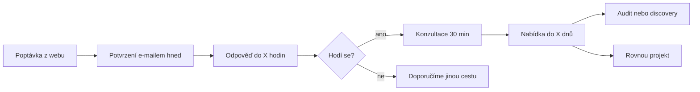

# B01: Služby, zákazníci, nabídka

_Byznys analýza v2, session B01, 29. 9. 2026, issue #10_

Podklady: `docs/web-v2/zadani.md`, `sitemap-relume.csv`, `reference-halo-lab.md`, rešerše veřejného webu (zdroje v kapitole 8). Staré texty webu jsem nečetl. Fakta o nás, která nemám, jsou označená `[DOPLNIT]`.

## TL;DR

1. **Nejlepší poptávky přinese MSP s konkrétním spouštěčem.** Web je zastaralý, nenosí poptávky nebo firma mění značku. Právě tady je rozpočet 70–190 tis. Kč, který na trhu platí za web od Webflow studia.
2. **Z 10 stránek služeb dává smysl 8.** Design webu sloučit do vývoje webu, grafický design sloučit do vizuální identity. Chybí ale stránka pro agentury, přestože jsou třetí cílovkou.
3. **Největší slabina není text, ale důkazy.** Máme 4 projekty. Nepokrývají UX audit ani landing page a nemají čísla. U MVP, redesignu a Webflow zatím nevíme, jestli je pokrývají. Bez dotazníku faktů (kapitola 6) zůstane polovina argumentů `[DOPLNIT]`.
4. **Vstupní produkt:** konzultace 30 min zdarma a placený audit webu s pevnou cenou, který se odečte z ceny projektu. Audit s veřejnou cenou už na trhu je (20–39 tis. Kč), odlišit nás může právě odečet z projektu.
5. **Formulář musí filtrovat.** Poptávkové portály ukazují rozpočty 12–35 tis. Kč. Bez otázky na rozpočet a termín přijdou stejné poptávky i k nám.

### Rozhodnutí pro Lukáše

| # | Otázka | Doporučení | Proč |
|---|---|---|---|
| 1 | Sloučit `/design-webovych-stranek` do `/vyvoj-webovych-stranek` a `/graficky-design` do `/vizualni-identita`? | **Ano** | MSP kupuje celý web, ne samotný design. Grafika po kusech přitahuje malé zakázky. Definitivně rozhodne B02 podle hledanosti. |
| 2 | Ukázat na webu cenová rozpětí „od–do“ u každé služby? | **Ano** | V rešerši cen uváděla většina ceníků jen „od X Kč“ (kapitola 8), přímou konkurenci ověří B02. Rozpětí odradí poptávky s malým rozpočtem dřív, než zaberou čas. |
| 3 | Nabízet placený audit webu s pevnou cenou, který se odečte z ceny projektu? | **Ano** | Nízký závazek pro klienta, pro nás kvalifikace. Klient, který zaplatí audit, má rozpočet. |
| 4 | Přidat do formuláře pole „rozpočet“ a „termín“? | **Ano** | Bez nich nepoznáme kvalitu poptávky. Riziko: povinné pole může ubrat poptávky. Proto volba „zatím nevím“ a dopad změří S04. Pozor: změna formuláře vyžaduje úpravu Make scénáře (`CLAUDE.md`). |
| 5 | Chceme stránku pro agentury (white-label, vedení projektu)? | **Ano** | Agentury hledají jinak a bojí se jiných věcí než MSP. Stránka služby jim neodpoví. Strukturu navrhne T01. |

---

## 1. Segmenty zákazníků

### Přehled

| | **MSP** (priorita 1) | **Startupy a nové produkty** (2) | **Agentury, white-label** (3) |
|---|---|---|---|
| **Kdo rozhoduje** | Majitel nebo jednatel. Ve větší firmě obchodní nebo marketingový ředitel, schvaluje majitel. | Zakladatel, často spolu s technickým spoluzakladatelem nebo investorem. | Majitel agentury, account manager nebo vedoucí produkce. |
| **Co spustí nákup** | Web je starý a nefunguje na mobilu. Web nenosí poptávky. Nová značka, nová služba, nová firma. Konkurence vypadá lépe. | Potřeba ověřit nápad a získat první zákazníky. Blíží se investorská schůzka nebo spuštění kampaně. | Agentura nemá kapacitu. Klient chce Webflow a agentura ho neumí. Odešel vývojář. |
| **Co chce slyšet** | Kolik to stojí a kdy to bude. Že web přinese poptávky. Že si ho upraví sám. Že se nemusí o nic starat. | Že výsledek uvidí rychle. Že neutratí za funkce, které nikdo nepoužije. Že produkt patří jemu. | Že dodáme včas a v kvalitě. Že nebudeme oslovovat jejich klienta. Že komunikace poběží přes ně. |
| **Podle čeho vybírá** | Reference z podobného oboru, jasná cena, rychlá odpověď, smlouva s termíny, doporučení známého. | Rychlost, zkušenost s MVP, vlastnictví kódu, cena prvního kroku, jestli dodavatel chápe byznys. | Kvalita práce na ukázkách, spolehlivost termínů, rychlost odpovědí, sazba, NDA a zákaz přetahování klientů. |
| **Kde hledá** | Google, doporučení, poptávkové portály, stále častěji AI asistenti. | Doporučení v komunitě, LinkedIn, Google, AI asistenti. | Doporučení, Webtrh.cz (poptávky a seznamka), LinkedIn. |

**AI asistenti jako zdroj.** Podle Forresteru (2025) používá AI při nákupu 94 % firemních kupujících a berou ji jako přínosnější zdroj než weby dodavatelů [Z30]. Gartner uvádí 45 % B2B kupujících s GenAI [Z31, nepřímo ověřeno]. České údaje o tom, odkud MSP hledá dodavatele webu, chybí. Doporučení: `[DOPLNIT: odkud přišly poslední poptávky]` a sledovat to v S04.

### Obavy a námitky podle segmentů

Obavy MSP a startupů popisují hlavně články dodavatelů [Z20–Z25]. Přímé citace kupujících jsou z poptávek a diskuse na Webtrh.cz [Z26–Z29].

**MSP**

| # | Obava | Jak ji zákazník říká |
|---|---|---|
| M1 | Předraží se to, nebo zaplatím zbytečně moc. | „45K bych za něj nedal“ [Z26] |
| M2 | Nedodrží termín. | „nestíhá průběžné termíny“ [Z20] |
| M3 | Nebudou komunikovat, budu je honit. | „jak pohotově agentura odpovídá na zprávy“ [Z20] |
| M4 | Neupravím si web sám, za každou změnu zaplatím. | „editovatelné texty bez nutnosti zásahu tvůrce webu“ [Z27] |
| M5 | Budu na dodavateli závislý (doména, přístupy, kód). | parafráze [Z21, Z22] |
| M6 | Skryté náklady: hosting, licence, údržba. | parafráze [Z21, Z22] |
| M7 | Web bude hezký, ale nepřinese poptávky. | „zaměřen na zaslání poptávky“ [Z27] |
| M8 | Nikdo mě nenajde na Googlu. | „SEO optimalizace pro vyhledávače“ [Z27] |

**Startupy**

| # | Obava | Poznámka |
|---|---|---|
| S1 | Utratím rozpočet za funkce, které nikdo nechce. | podle [Z23] |
| S2 | Vývoj bude trvat měsíce, trh mezitím uteče. | MVP na trhu trvá 2–6 měsíců [Z11–Z13] |
| S3 | Kód a produkt nebudou moje (vendor lock-in). | [Z24] |
| S4 | Agentura práci jen přeprodá dál. | parafráze [Z25] |
| S5 | Dodavatel nerozumí byznysu, jen programuje. | podle [Z23] |
| S6 | Nebude to škálovat, po ověření začneme znovu. | odvozeno, neověřeno citací |

**Agentury**

| # | Obava | Zdroj |
|---|---|---|
| A1 | Subdodavatel nedodá kvalitu, kterou agentura podepsala. | [Z32] |
| A2 | Nedodrží termín a agentura to schytá od klienta. | [Z32] |
| A3 | Pomalá komunikace. „Tým, který odpoví až za několik dní, nadělá víc problémů, než kolik jich vyřeší.“ | [Z33], volný překlad |
| A4 | Subdodavatel přetáhne klienta. | [Z32, Z34] |
| A5 | Únik dat a duševního vlastnictví. | [Z32] |
| A6 | Sazba sní marži. | [Z32] |
| A7 | Subdodavatel zmizí uprostřed projektu. | [Z32] |

---

## 2. Služby

### Přehled a doporučení

| Stránka | Segment | Doporučení | Proč |
|---|---|---|---|
| `/vyvoj-webovych-stranek` | MSP | **Samostatná, hlavní** | Nejčastější poptávka, nejvyšší hledanost (ověří B02). Máme důkaz ELDR. |
| `/redesign-webovych-stranek` | MSP | **Samostatná** | Jiný spouštěč („mám starý web“) a jiná obava (přijdu o pozice a obsah). `[DOPLNIT: je ELDR redesign?]` |
| `/webflow-vyvoj` | MSP, agentury | **Samostatná** | Naše odlišení a hlavní služba pro agentury. |
| `/landing-page` | startupy, MSP | **Samostatná** | Jasný rozsah, rychlé dodání, vstup pro startupy. Chybí nám ukázka. |
| `/ux-audit` | MSP, startupy | **Samostatná** | Vstupní produkt (kapitola 4). Chybí ukázka, stačí anonymizovaný výstup. |
| `/vyvoj-mvp` | startupy | **Samostatná** | Priorita 2 v zadání, jiný kupující i obavy než u aplikací. `[DOPLNIT: dodáváme sami, nebo s partnerem?]` |
| `/vyvoj-webovych-aplikaci` | MSP, startupy | **Samostatná** | Máme dva důkazy (Anse, CRR). Vyšší rozpočty. |
| `/vizualni-identita` | MSP, startupy | **Samostatná** | Máme důkaz Arbosis. Často předchází webu. |
| `/design-webovych-stranek` | MSP, agentury | **Sloučit** do vývoje webu | MSP design samostatně nekupuje. Agenturám design nabídne stránka Webflow nebo pro agentury. Pokud B02 najde silnou hledanost, zůstane jako tenká stránka. |
| `/graficky-design` | MSP | **Sloučit** do vizuální identity, nebo odložit | Na trhu se prodává za 700–1 500 Kč/h [Z16–Z18]. Přitahuje malé zakázky, které jdou proti cíli „lepší poptávky“. |
| _chybí_ | agentury | **Přidat** (návrh pro T01) | Třetí segment nemá kam přijít. Vedení projektu na subdodávku není v sitemapě vůbec. |

### Karty služeb

Ceny jsou orientační rozpětí z veřejných ceníků a článků. Většina zdrojů neuvádí, zda jde o ceny s DPH. Naše ceny v kapitole 4 jsou **návrh**, ne fakt.

#### Vývoj webových stránek

| | |
|---|---|
| **Segment** | MSP |
| **Problém a spouštěč** | Firma nemá web, nebo má starý a nefunkční. Web nepřináší poptávky. |
| **Co kupuje (JTBD)** | „Chci, aby mě zákazník našel, pochopil, co dělám, a poslal poptávku.“ |
| **Výsledek** | Web, který se načte rychle, funguje na mobilu, jde upravovat bez programátora a měří poptávky. |
| **Rozsah a výstupy** | Struktura, texty nebo jejich redakce, design, vývoj, SEO základ, měření, zaškolení. 5–10 stránek. |
| **Trh: cena** | Freelancer a malé studio 30–80 tis. [Z1, Z4], MSP obvykle 50–150 tis., firemní web od agentury 100–250 tis. [Z2], celé rozpětí trhu 30–400 tis. [Z4] |
| **Trh: termín** | 3–6 týdnů u firemního webu [Z1], 4–6 týdnů [Z3], 1–3 měsíce u pokročilých webů [Z1] |
| **Cross-sell** | Vizuální identita (předem), správa a rozvoj webu, landing page pro kampaně, UX audit po 3 měsících. |

#### Redesign webových stránek

| | |
|---|---|
| **Segment** | MSP |
| **Problém a spouštěč** | Web vypadá staře, nefunguje na mobilu, je pomalý, klient se za něj stydí. |
| **Co kupuje** | „Chci lepší web, ale nechci přijít o to, co funguje: pozice na Googlu, obsah, poptávky.“ |
| **Výsledek** | Nový web se zachovanými URL nebo přesměrováním, lepší rychlost, jasnější cesta k poptávce. |
| **Rozsah a výstupy** | Audit starého webu, mapa přesměrování, nová struktura, design, vývoj, převod obsahu, kontrola po spuštění. |
| **Trh: cena** | Zhruba 70–80 % ceny nového webu [Z3], běžně od 35 tis. [Z6]. Levné nabídky 7,5–13 tis. [Z7] |
| **Trh: termín** | Do 1 měsíce u menších webů, 3–12 týdnů [Z7] |
| **Cross-sell** | UX audit (jako první krok), nová vizuální identita, správa webu. |

#### Webflow vývoj

| | |
|---|---|
| **Segment** | MSP (kdo chce web upravovat sám), agentury (kdo potřebuje Webflow kapacitu) |
| **Problém a spouštěč** | WordPress je pomalý a potřebuje aktualizace. Klient chce měnit texty sám. Agentura má klienta s Webflow a nemá vývojáře. |
| **Co kupuje** | „Chci web, který si upravím sám a nebudu řešit pluginy a bezpečnost.“ Agentura: „Chci někoho, kdo to postaví správně a včas.“ |
| **Výsledek** | Webflow web s čistou strukturou tříd a CMS, zaškolený klient, předané přístupy. |
| **Rozsah a výstupy** | Stavba z designu (vlastního nebo dodaného), CMS, interakce, SEO a měření, předání. |
| **Trh: cena** | Od 25 tis., větší weby 40–150 tis. [Z8], firemní web 70–150 tis. [Z9], design a vývoj 129–189 tis. [Z10]. Sazby 1 200–2 000 Kč/h [Z8, Z10] |
| **Trh: termín** | Landing page 14 dní, firemní web 1 měsíc, složitější 2–3 měsíce [Z9] |
| **Pozor** | Provoz Webflow se platí v USD a vychází dráž než hosting WordPressu [Z35]. Námitka M6, na webu ji musíme vysvětlit dopředu. |
| **Cross-sell** | Správa a rozvoj, migrace z WordPressu, white-label pro agentury. |

#### Landing page

| | |
|---|---|
| **Segment** | Startupy (ověření nápadu), MSP (kampaň, nová služba) |
| **Problém a spouštěč** | Spouští se kampaň nebo produkt. Hlavní web na to nestačí nebo se nedá rychle upravit. |
| **Co kupuje** | „Potřebuju stránku, která do 2 týdnů začne sbírat kontakty.“ |
| **Výsledek** | Jedna stránka s jasnou nabídkou, formulářem a měřením konverzí, připravená na reklamu. |
| **Rozsah a výstupy** | Text nebo jeho redakce, design, vývoj, formulář, napojení měření, případně A/B varianta. |
| **Trh: cena** | Běžně 10–35 tis. [Z1, Z3], Webflow studio od 35 tis. [Z9] |
| **Trh: termín** | 1–2 týdny [Z1, Z9] |
| **Cross-sell** | MVP, celý web, UX audit po kampani. |

#### UX audit

| | |
|---|---|
| **Segment** | MSP (web nefunguje), startupy (produkt nekonvertuje) |
| **Problém a spouštěč** | Web má návštěvnost, ale málo poptávek. Nevíme, jestli stačí úpravy, nebo je potřeba nový web. |
| **Co kupuje** | „Chci vědět, co nefunguje a co opravit dřív, než utratím za nový web.“ |
| **Výsledek** | Seřazený seznam problémů s návrhem řešení a odhadem dopadu. Klient ví, co dělat dál. |
| **Rozsah a výstupy** | Heuristická analýza, kontrola analytiky, mobil, rychlost, cesta k poptávce. Report a schůzka. |
| **Trh: cena** | Heuristika 20–30 tis., s testováním 50–150 tis. [Z12a–Z12c], audit webu od 39 tis. [Z12d] |
| **Trh: termín** | 2–4 týdny [Z12a], zhruba měsíc [Z12d] |
| **Cross-sell** | Redesign, vývoj webu, landing page. Audit je vstupní produkt (kapitola 4). |

#### Vývoj MVP

| | |
|---|---|
| **Segment** | Startupy a nové produkty ve firmách |
| **Problém a spouštěč** | Nápad je hotový, chybí produkt, na kterém ho ověří. Blíží se investor, akcelerátor nebo kampaň. |
| **Co kupuje** | „Chci co nejdřív zjistit, jestli to někdo chce, a neutratit za to celý rozpočet.“ |
| **Výsledek** | Funkční první verze s hlavní funkcí, kterou vyzkouší skuteční uživatelé. Měření použití. Kód a přístupy patří klientovi. |
| **Rozsah a výstupy** | Discovery (co je opravdu potřeba), prototyp, vývoj, spuštění, plán další verze. |
| **Trh: cena** | Malé MVP 60–300 tis. [Z11], webové MVP 200–600 tis. [Z12, Z13], studia 0,4–1,4 mil. [Z14]. Česká cena no-code MVP nenalezena. |
| **Trh: termín** | 2 měsíce [Z11], 2–3 měsíce [Z12], 3–6 měsíců [Z13] |
| **Cross-sell** | Landing page (ověření před MVP), vizuální identita, webová aplikace (další verze). |

#### Vývoj webových aplikací

| | |
|---|---|
| **Segment** | MSP s procesem v Excelu nebo na papíře, organizace, startupy po MVP |
| **Problém a spouštěč** | Proces stojí na tabulkách a e-mailech. Chyby a ztracené zakázky. Firma roste a stávající nástroj nestačí. |
| **Co kupuje** | „Chci mít přehled a přestat to dělat ručně.“ |
| **Výsledek** | Aplikace, která pokryje konkrétní proces (zakázky, zaměření, schvalování), funguje na mobilu i v terénu. |
| **Rozsah a výstupy** | Analýza procesu, návrh, prototyp, vývoj po etapách, zaškolení, podpora. |
| **Trh: cena** | Vstup od 149 tis. [Z15], střední rozsah 0,3–1,5 mil. [Z11, Z12], SaaS 1–3 mil. [Z12]. Sazby agentur 1 500–2 800 Kč/h, MD 10–16 tis. [Z5, Z15, Z15a] |
| **Trh: termín** | 3–6 měsíců u středního rozsahu [Z12], SaaS 4–9 měsíců [Z12] |
| **Cross-sell** | Podpora a rozvoj, UX audit aplikace, web pro produkt. |

#### Vizuální identita

| | |
|---|---|
| **Segment** | MSP (nová firma nebo přerod značky), startupy |
| **Problém a spouštěč** | Logo je staré nebo amatérské. Firma vypadá menší, než je. Chystá se nový web, auta, oblečení. |
| **Co kupuje** | „Chci vypadat jako firma, které se dá věřit, a mít pravidla, podle kterých to udržím.“ |
| **Výsledek** | Logo, barvy, písma a pravidla použití. Hotové šablony pro to, co firma opravdu používá. |
| **Rozsah a výstupy** | Rozhovor a rešerše, návrhy loga, logomanuál, aplikace (vizitky, auta, dokumenty, sítě). |
| **Trh: cena** | Freelancer 7–25 tis., střední studio 25–100 tis., prémiový designér 67–163 tis. [Z16a], identita v průměru cca 100 tis. [Z16b] |
| **Trh: termín** | 3–6 týdnů [Z16c] |
| **Cross-sell** | Web (téměř vždy), grafika a šablony, landing page. |

#### Design webových stránek (sloučit)

| | |
|---|---|
| **Segment** | MSP, agentury (design na subdodávku) |
| **Problém a spouštěč** | Firma nebo agentura má vlastního vývojáře, chybí jí návrh. Web vypadá amatérsky. |
| **Co kupuje** | Návrh, podle kterého postaví web někdo jiný. |
| **Výsledek** | Hotový návrh všech stránek pro desktop i mobil, připravený k předání vývoji. |
| **Rozsah a výstupy** | Struktura, wireframy, design ve Figmě, knihovna komponent, předání vývojáři. |
| **Trh: cena** | Samostatný design 69–99 tis. [Z10], jako část webu 9–25 tis. [Z3] |
| **Trh: termín** | Zdroje samostatný termín neuvádějí. |
| **Cross-sell** | Webflow vývoj (stavba podle návrhu), vizuální identita. |
| **Proč sloučit** | MSP chce hotový web. Samotný design kupují hlavně agentury, a ty obslouží stránka pro agentury. |

#### Grafický design (sloučit nebo odložit)

| | |
|---|---|
| **Segment** | MSP |
| **Problém a spouštěč** | Chystá se veletrh, kampaň nebo prezentace. Materiály nevypadají jednotně. |
| **Co kupuje** | Leták, prezentaci, příspěvky na sítě. |
| **Výsledek** | Hotové podklady v jednotném stylu, připravené pro tisk nebo sítě. |
| **Rozsah a výstupy** | Návrh, úpravy, tisková data nebo šablony. |
| **Trh: cena** | 700–1 500 Kč/h u freelancerů [Z17], leták od 1 500, katalog od 8 000 [Z16], prezentace 900–3 400 Kč za slide [Z18] |
| **Trh: termín** | 7–14 dní [Z16d], do 10 pracovních dnů po schválení [Z16e] |
| **Cross-sell** | Vizuální identita, šablony dokumentů a prezentací. |
| **Proč sloučit** | Malé zakázky, tlak na cenu, nesouvisí s cílem „víc poptávek na web“. Grafiku nabídneme jako pokračování vizuální identity. |

---

## 3. Argumenty a důkazy

„Máme?“: **ano** = důkaz existuje a smíme ho použít, **ne** = neexistuje, `[DOPLNIT]` = může existovat, potvrdí Lukáš.

| Námitka | Argument | Důkaz | Máme? |
|---|---|---|---|
| M1 Předraží se to | Cenu známe předem. Rozpětí je na webu, pevná cena ve smlouvě. | Veřejná rozpětí, vzorová nabídka, smlouva s pevnou cenou | ne (vznikne rozhodnutím 2) |
| M2 Nedodrží termín | Termín je v harmonogramu po týdnech a klient vidí průběh. | Termíny z projektů („plán 6 týdnů, hotovo za 6“) | `[DOPLNIT]` |
| M3 Nebudou komunikovat | Odpovíme do stanovené doby, jeden člověk vede projekt. | Závazek doby odpovědi, citace klienta o komunikaci | `[DOPLNIT]` |
| M4 Neupravím si web sám | Webflow editor, zaškolení, návod. | Video nebo snímek editoru, citace klienta | `[DOPLNIT]` |
| M5 Závislost na dodavateli | Doména, přístupy i obsah patří klientovi. | Věta ve smlouvě | `[DOPLNIT]` |
| M6 Skryté náklady | Provoz a licence ukážeme v nabídce předem. | Tabulka ročních nákladů | ne |
| M7 Nepřinese poptávky | Web stavíme kolem cesty k poptávce a měříme ji. | Číslo z projektu (poptávky před a po) | `[DOPLNIT]` (ELDR?) |
| M8 Nenajdou mě | SEO a GEO základ je v ceně. | Pozice nebo návštěvnost z projektu | `[DOPLNIT]` |
| S1 Zbytečné funkce | Začínáme discovery a stavíme jen to, co ověří nápad. | Popis procesu, rozsah MVP z projektu | `[DOPLNIT]` (Anse?) |
| S2 Trvá to dlouho | Pevný termín první verze. | Termín z projektu | `[DOPLNIT]` |
| S3 Kód není můj | Kód, data a přístupy předáváme. | Věta ve smlouvě | `[DOPLNIT]` |
| S4 Přeprodává práci | Řekneme předem, kdo na projektu dělá. | Tým nebo partneři jmenovitě | `[DOPLNIT]` |
| S5 Nerozumí byznysu | Jeden člověk vede projekt od zadání po spuštění a řeší i byznysový cíl. | Kdo projekt vede a s jakou praxí, citace klienta | `[DOPLNIT: kdo vede projekt, roky praxe]` |
| S6 Nebude škálovat | Volba technologie podle dalšího kroku, ne podle rychlosti. | Anse nebo CRR v provozu | `[DOPLNIT]` |
| A1 Kvalita | Ukázky práce, zkušební menší zakázka. | Portfolio, Webflow Partner | Portfolio ano, Partner `[DOPLNIT]` |
| A2 Termín | Harmonogram a průběžné předávky. | Reference agentury | `[DOPLNIT]` |
| A3 Komunikace | Doba odpovědi, sdílený kanál. | Závazek | `[DOPLNIT]` |
| A4 Přetahování klienta | NDA a zákaz oslovení klienta ve smlouvě. | Vzor smlouvy | `[DOPLNIT]` |
| A5 Data | NDA, přístupy jen po dobu projektu. | Vzor NDA | `[DOPLNIT]` |
| A6 Marže | Pevná cena nebo sazba MD známá předem. | Ceník pro agentury | ne |
| A7 Zmizí | Dokumentace a předání průběžně. | Předávací protokol | ne |

**Obecné důkazy ze zadání:** odznak Webflow Partner a recenze na Google. Oba `[DOPLNIT]`. Logo klientů `[DOPLNIT: která smíme ukázat]`.

**Důkazy podle služeb.** Projekty pokrývají 4 služby z 8 doporučených:

| Projekt | Co je vidět na náhledu | Služba | Chybí |
|---|---|---|---|
| ELDR | Web firmy se světelnou reklamou, desktop i mobil | vývoj webu, případně redesign | čísla, citace, nový nebo redesign |
| CRR | Intranet s vizuálním stylem a šablonami pro organizaci | webová aplikace, vizuální styl | čísla, citace, jestli je v provozu |
| Anse | Aplikace pro montážní firmu (zaměření, nacenění, montáž) | webová aplikace, MVP | čísla, citace, jestli je v provozu |
| Arbosis | Logo a aplikace značky zahradnické firmy | vizuální identita | citace, jestli navazoval web |

Čísla na náhledech (například počty v mockupech) nepoužívám. Nevím, jestli jsou skutečná.

**Bez důkazu zůstávají:** UX audit, landing page a spolupráce s agenturami. **Nepotvrzené:** MVP (je Anse MVP?), redesign (je ELDR redesign?), Webflow (na čem projekty běží?). Pro UX audit stačí anonymizovaná ukázka reportu. Pro landing page stačí jedna vlastní (například landing page pro audit).

---

## 4. Prodejní balení nabídky

### Vstupní produkty

| Produkt | Pro koho | Cena (návrh) | Co klient dostane | Proč |
|---|---|---|---|---|
| **Konzultace 30 min** | všichni | zdarma | Odpověď, jestli a jak můžeme pomoct, orientační cena a termín. | Standard trhu, konzultaci zdarma nabízí skoro každý [Z19]. Bez ní ztratíme srovnání. |
| **Audit webu** (zkrácený UX audit) | MSP s webem | `[DOPLNIT]`, doporučeno 15–25 tis. Kč | Report s 10–20 seřazenými problémy, schůzka, odhad ceny řešení. Cena se odečte z projektu. | Trh má audit od 20–39 tis. [Z12a, Z12d]. Klient získá hodnotu i bez projektu, my kvalifikovaného klienta. |
| **Discovery workshop** | startupy, aplikace | `[DOPLNIT]`, doporučeno 20–40 tis. Kč | Rozsah první verze, prototyp hlavní obrazovky, rozpočet a harmonogram. Odečte se z vývoje. | Snižuje obavu S1. Veřejnou cenu discovery má na trhu málokdo [Z14]. |
| **Zkušební zakázka** | agentury | podle rozsahu | Jedna menší stránka nebo sekce ve Webflow. | Snižuje obavu A1 bez velkého rizika pro obě strany. |

### Balíčky (návrh k potvrzení)

Rozpětí vychází ze střední vrstvy trhu (Webflow studia a menší agentury). **Nejsou to naše ceny, dokud je Lukáš nepotvrdí.**

| Balíček | Obsah | Návrh ceny | Návrh termínu | Tržní opora |
|---|---|---|---|---|
| Landing page | 1 stránka, text, formulář, měření | 35–60 tis. | 2–3 týdny | [Z1, Z9] |
| Firemní web | 5–10 stránek, CMS, SEO a měření, zaškolení | 80–180 tis. | 5–8 týdnů | [Z2, Z9, Z10] |
| Redesign | Firemní web a audit starého webu, přesměrování | 70–160 tis. | 5–8 týdnů | [Z3, Z6] |
| Vizuální identita | Logo, manuál, 5 aplikací | 40–100 tis. | 3–6 týdnů | [Z16a, Z16b] |
| MVP | Discovery, prototyp, první verze | od 200 tis. | 8–12 týdnů | [Z11–Z13] |
| Webová aplikace | Po etapách, první etapa | od 250 tis. | podle rozsahu | [Z11, Z12, Z15] |
| Pro agentury | Webflow vývoj, vedení projektu | sazba MD `[DOPLNIT]`, trh zhruba 7–12 tis. | podle rozsahu | [Z15, Z36], rozpětí odvozené |
| Správa a rozvoj | Úpravy, kontrola měření, drobný rozvoj | `[DOPLNIT]`, trh 2–4 tis. měsíčně | měsíčně | [Z8] |

**Doporučená minimální zakázka:** `[DOPLNIT]`, doporučeno 35 tis. Kč. Pod touto hranicí vede formulář na konzultaci, ne na nabídku.

### Co se stane po odeslání poptávky

| Krok | Co zákazník uvidí | Kdy | Stav |
|---|---|---|---|
| 1 | Automatické potvrzení s popisem dalších kroků | hned | e-mail existuje (`docs/formular/`), text se napíše znovu |
| 2 | Osobní odpověď, návrh termínu hovoru | `[DOPLNIT: do kolika hodin]` | |
| 3 | Konzultace 30 min | do `[DOPLNIT]` dnů | |
| 4 | Nabídka s pevnou cenou, termínem a ročními náklady | do `[DOPLNIT]` dnů od hovoru | |
| 5 | Smlouva a záloha, start | | `[DOPLNIT: výše zálohy]` |

Poptávce, která se nehodí, pošleme krátkou odpověď s tipem (například šablonu nebo jiný typ dodavatele). Chrání to recenze i značku.

### Kvalifikační otázky do formuláře

Dnes má formulář 4 pole (`co-resite`, `name`, `firma`, `email`). **Každé nové pole vyžaduje úpravu Make scénáře.**

| # | Otázka | Typ | Proč | Povinné |
|---|---|---|---|---|
| 1 | Co potřebujete? (nový web, redesign, landing page, aplikace nebo MVP, identita, audit, spolupráce pro agenturu) | výběr | Směruje poptávku, měří zájem o služby | ano |
| 2 | Co máte teď vyřešit? | text (dnešní `co-resite`) | Spouštěč a problém vlastními slovy | ano |
| 3 | Jaký máte rozpočet? (do 35 tis., 35–80 tis., 80–200 tis., nad 200 tis., zatím nevím) | výběr | Hlavní filtr kvality. Volba „zatím nevím“ nesnižuje počet poptávek. | ano |
| 4 | Kdy to potřebujete? (do měsíce, 1–3 měsíce, později, zatím nevím) | výběr | Priorita a kapacita | ne |
| 5 | Máte současný web? (URL) | text | Rychlá příprava na hovor | ne |
| 6 | Jméno, firma, e-mail | text | Kontakt (dnešní pole) | ano, firma ne |
| 7 | Odkud o nás víte? | výběr | Zdroj poptávky včetně AI asistentů, doplní chybějící data | ne |

Pro agentury stačí stejný formulář s volbou „spolupráce pro agenturu“ v otázce 1.

---

## 5. Slovník značky

### Říkáme / neříkáme

| Říkáme | Neříkáme | Proč |
|---|---|---|
| web, stránky | webová prezentace, online řešení | Zákazník říká „web“ [Z27] |
| poptávky, zákazníci | leady, konverze | Žargon. „Konverze“ jen s vysvětlením. |
| upravíte si sám | intuitivní CMS | Mluví výsledkem [Z27] |
| cena od–do, pevná cena | cena na míru, individuální kalkulace | Odpovídá na obavu M1 |
| za 6 týdnů | v rekordním čase | Konkrétní číslo místo slibu |
| první verze (MVP) | minimálně životaschopný produkt | Zkratku vysvětlit jednou |
| správa a rozvoj | péče, support | Konkrétní činnost |
| předáme vám přístupy | transparentní spolupráce | Fakt místo přívlastku |
| najdou vás na Googlu i v AI asistentech | SEO a GEO optimalizace | Výsledek místo zkratky. Zkratky jen ve FAQ. |
| postavíme, navrhneme, spustíme | implementujeme, realizujeme řešení | Plnovýznamová slovesa |
| - | komplexní řešení, na míru vašim potřebám, inovativní, jedinečný, špičkový, bez starostí, zážitek, vášeň, digitální transformace | Zakázaná vata (`CLAUDE.md`) |

### Tón podle segmentu

| Segment | Tón | Co zdůraznit | Příklad směru (ne hotový text) |
|---|---|---|---|
| MSP | Klidný, věcný, jednoduchý. Bez techniky. | Cena, termín, poptávky, samostatnost | „Kolik to stojí a kdy to bude“ na začátku stránky |
| Startupy | Rychlejší, přímý, byznysový. | Rychlost, ověření, vlastnictví | „Co postavíme jako první a proč“ |
| Agentury | Kolegiální, stručný, technicky přesný. | Spolehlivost, diskrétnost, proces | Seznam toho, co dodáme a v jakém formátu |

---

## 6. Dotazník faktů pro Lukáše

Odpovídej jedním slovem nebo číslem. Otázky 9–12 mají víc krátkých odpovědí, stačí je oddělit lomítkem. Doporučená odpověď je jen tip, nic se nezveřejní bez potvrzení. Co nechceš mít na veřejném webu, napiš „neveřejné“.

| # | Otázka | Doporučená odpověď |
|---|---|---|
| 1 | Kolik projektů jsme dokončili celkem? (číslo) | skutečné číslo, i malé |
| 2 | Kolik let praxe v oboru můžeme uvést? (číslo) | počet let v digitálních projektech |
| 3 | Jsme Webflow Partner? (ano / ne / v procesu) | ano, pokud je odznak aktivní |
| 4 | Google recenze: kolik a jaký průměr? (např. 8 / 5,0) | uvést, jen když je aspoň 5 recenzí |
| 5 | Nejmenší zakázka, kterou bereme? (Kč) | 35 000 |
| 6 | Firemní web ve Webflow: cena od–do? (Kč) | 80 000–180 000 |
| 7 | Firemní web: obvyklý termín? (týdny) | 6 |
| 8 | Aplikace a MVP vyvíjíme sami, nebo s partnerem? (sami / partner) | pravdivě, na webu to řekneme otevřeně |
| 9 | ELDR: rok / nový web nebo redesign / termín v týdnech / jedno číslo výsledku / smíme logo a citaci? | např. 2025 / redesign / 6 / +X poptávek / ano |
| 10 | CRR: rok / co přesně jsme dodali / je v provozu? / jedno číslo / smíme logo a citaci? | např. 2026 / intranet a šablony / ano / počet uživatelů / ano |
| 11 | Anse: rok / MVP nebo hotová aplikace / je v provozu? / jedno číslo / smíme logo a citaci? | např. 2026 / MVP / ano / počet zakázek v systému / ano |
| 12 | Arbosis: rok / co vše obsahovala identita / navazoval web? / smíme logo a citaci? | např. 2025 / logo a 5 aplikací / ne / ano |
| 13 | Loga kterých dalších klientů smíme ukázat? (názvy / žádná) | jen s písemným souhlasem |
| 14 | Záruka po spuštění: kolik měsíců opravujeme chyby zdarma? (číslo) | 3 |
| 15 | Do kolika hodin odpovíme na poptávku? (číslo) | 24 |

---

## 7. Co z toho plyne pro další session

| Pro | Co |
|---|---|
| B02 | Ověřit hledanost pro `design webových stránek`, `grafický design` a `landing page` (rozhodnutí 1). Zjistit, jak konkurence ukazuje ceny. |
| T01 | Stránka pro agentury (rozhodnutí 5). Pořadí sekcí podle obav: MSP začíná cenou a termínem, startup rychlostí, agentura procesem. |
| T02, T03 | Slovník a tón z kapitoly 5. Námitky z kapitoly 3 jako FAQ. |
| S04 | Pole formuláře z kapitoly 4 a otázka „Odkud o nás víte?“. Úprava Make scénáře. |
| Lukáš | Dotazník (kapitola 6) a rozhodnutí 1–5. |

---

## 8. Zdroje

Přístup 29. 9. 2026. Rok u zdroje, pokud ho stránka uvádí.

| # | Zdroj | Co z něj je |
|---|---|---|
| Z1 | [le-artist.cz: Kolik stojí web](https://www.le-artist.cz/blog/kolik-stoji-web) (4/2026) | firemní web 30–80 tis., 3–6 týdnů; landing page 10–30 tis., 1–2 týdny |
| Z2 | [anfilov.cz: Kolik stojí web](https://anfilov.cz/clanky/kolik-stoji-web) (4/2026) | MSP 50–150 tis., firemní web 100–250 tis.; sazby 600–2 500 Kč/h |
| Z3 | [designee.cz: Kolik stojí webové stránky](https://designee.cz/blog/kolik-stoji-webove-stranky/) (9/2026) | firemní web od 35 tis., 4–6 týdnů; redesign 70–80 % ceny; design 9–25 tis.; landing page do 35 tis. |
| Z4 | [webfusion.cz: Kolik stojí webové stránky 2026](https://webfusion.cz/kolik-stoji-webove-stranky-v-roce-2026/) (1/2026) | průměr 30–80 tis., agentury 30–400 tis. |
| Z5 | [shean.cz: sazby freelancerů a agentur](https://www.shean.cz/blog/kolik-stoji-vyvoj-webu-a-e-shopu-v-roce-2025-srovnani-sazeb-freelanceru-a-agentur-nejen-v-brne) (2/2026) | freelanceři 800–1 800 Kč/h, agentury 1 500–2 800 Kč/h |
| Z6 | [pisuweby.cz: Redesign](https://pisuweby.cz/redesign-webovych-stranek/) | redesign od 35 tis. |
| Z7 | [forge-agency.cz: Redesign webu](https://forge-agency.cz/redesign-webu) | 7 490 až 12 900, 3–12 týdnů |
| Z8 | [softmedia.cz: Webflow](https://softmedia.cz/webflow-tvorba-a-sprava-webu/) | od 25 tis., 40–150 tis., 1 200–2 000 Kč/h, správa 1 990 a 3 900 Kč měsíčně |
| Z9 | [animato.cz: O Webflow](https://www.animato.cz/o-webflow) | landing page od 35 tis. za 14 dní, firemní web 70–150 tis. za 1 měsíc |
| Z10 | [lukasaugusta.cz](https://www.lukasaugusta.cz/) | design 69–99 tis., design a vývoj 129–189 tis., 1 800 Kč/h |
| Z11 | [propix.cz: Kolik stojí vývoj softwaru](https://propix.cz/kolik-stoji-vyvoj-custom-softwaru/) (10/2025) | MVP 60–300 tis., cca 2 měsíce; střední rozsah 0,3–1 mil. |
| Z12 | [dostaljakub.cz: Kolik stojí webová aplikace](https://dostaljakub.cz/blog/kolik-stoji-vyvoj-webove-aplikace) (12/2025) | MVP 300–600 tis., 2–3 měsíce; střední 0,6–1,5 mil.; SaaS 1–3 mil. |
| Z12a | [thewild.cz: UX audit](https://thewild.cz/vyvoj-webovych-aplikaci/ux-ui-design/ux-audit) | od 20 tis., 2–4 týdny |
| Z12b | [anfilov.cz: UX audit webu](https://anfilov.cz/clanky/ux-audit-webu) (4/2026) | heuristika od 25 tis., s testováním 50–120 tis. |
| Z12c | [davidkoci.cz: UX analýza](https://davidkoci.cz/ux-analyza/) | cca 30 / 80 / 150 tis. |
| Z12d | [feo.cz: Audit webu](https://feo.cz/sluzby/audit-webu) | od 39 tis., cca měsíc |
| Z13 | [devboys.cz: Kolik stojí webová aplikace](https://devboys.cz/blog/web/kolik-stoji-vyvoj-webove-aplikace-kompletni-pruvodce-cenou) | MVP 200–600 tis., 3–6 měsíců |
| Z14 | [pixelfield.cz: Vývoj aplikací](https://pixelfield.cz/vyvoj-aplikaci/) | MVP 0,4–1,4 mil., 12–24 týdnů; konzultace zdarma; discovery 140–400 tis. |
| Z15 | [ananas.cz: Ceník](https://ananas.cz/cenik) (2026) | aplikace od 149 tis. bez DPH, 2 500 Kč/h, 10 tis./MD |
| Z15a | inited.cz, blogový článek o hodinové sazbě (2/2024, přesná URL nedohledána) | 16 tis./MD, průměrný senior cca 1 500 Kč/h |
| Z16 | [designcrew.cz: Ceník](https://designcrew.cz/cz/cenik/) | 700–800 Kč/h, leták od 1 500, katalog od 8 000 |
| Z16a | [anfilov.cz: Kolik stojí vizuální identita](https://anfilov.cz/clanky/kolik-stoji-vizualni-identita) (4/2026) | 7–25 / 25–100 / 67–163 / 150–500 tis. |
| Z16b | [kuuuk.cz: Kolik stojí logo a identita](https://kuuuk.cz/blog/kolik-stoji-logo-a-vizualni-identita) | logo od 28 tis., identita cca 100 tis. |
| Z16c | [pixelot.cz: Vizuální identita](https://pixelot.cz/sluzby/vizualni-identita/) | od 20 tis., 3–6 týdnů |
| Z16d | [studiokopic.cz: Ceník](https://studiokopic.cz/cenik.html) | 800 Kč/h, dodání 7–14 dní |
| Z16e | [gradiko.cz: Orientační ceník a termíny](https://gradiko.cz/informace/orientacni-cenik-a-terminy) | 800 Kč/h bez DPH, do 10 pracovních dnů |
| Z17 | [antoninparal.com: Kolik stojí grafika](https://antoninparal.com/kolik-stoji-kvalitni-grafika) | freelancer 700–1 500, agentura 1 500–5 000 Kč/h |
| Z18 | [odprezentuj.cz](https://odprezentuj.cz/tvorba-prezentaci-powerpoint/) | 900–3 400 Kč za slide |
| Z19 | pixelfield.cz, devority.cz, webui.cz, expert-dev.cz | konzultace nebo první schůzka zdarma |
| Z20 | [blueghost.cz: Jak vybrat agenturu](https://www.blueghost.cz/clanek/jak-vybrat-digitalni-agenturu-pro-tvorbu-webu/) | termíny, komunikace, prodražení |
| Z21 | [pixlo.cz: Jak vybrat webovou agenturu](https://pixlo.cz/blog/jak-vybrat-webovou-agenturu) | skryté náklady, přístupy, SEO sliby |
| Z22 | [justdigital.cz: Jak vybrat agenturu](https://www.justdigital.cz/blog/tvorba-webu-praha-jak-vybrat-agenturu/) | skryté náklady, přístupy |
| Z23 | [megumethod.com: Výběr dodavatele](https://www.megumethod.com/blog/vyber-dodavatele-vyvoj-software) | riziko špatného výběru |
| Z24 | [ackee.cz: Vendor lock-in](https://www.ackee.cz/blog/jak-vyzrat-na-vendor-lock-in-u-mobilnich-aplikaci) | předání kódu |
| Z25 | [damidev.com: Jak vybrat dodavatele](https://www.damidev.com/blog/vyvojari-radi-jak-vybrat-vhodneho-dodavatele-mobilni-aplikace) | přeprodávání práce |
| Z26 | [webtrh.cz: Stojí web za to?](https://webtrh.cz/diskuse/stoji-web-za-to/) (2024) | „45K bych za něj nedal“ |
| Z27 | [poptavej.cz: poptávka 209357334](https://www.poptavej.cz/poptavka/209357334-tvorba-webovych-stranek-graficky-navrh-cela-ceska-republika) | jazyk poptávky: editace, SEO, poptávky |
| Z28 | [poptavky.cz: Tvorba www stránek](https://www.poptavky.cz/poptavky/sluzby/tvorba-www-stranek) (9/2026) | rozpočty 12 500 a 35 000 Kč |
| Z29 | [webtrh.cz: Hledáme webaře na stálou spolupráci](https://webtrh.cz/poptavka/hledame-webare-na-stalou-spolupraci/) | poptávka agentury, 10–25 tis. |
| Z30 | [Forrester: B2B buyers' journey 2025](https://www.forrester.com/blogs/b2b_buyers_make_zero_click_buying_number_one/) | 94 % kupujících používá AI |
| Z31 | [Gartner: tisková zpráva 5/2026](https://www.gartner.com/en/newsroom/press-releases/2026-05-20-gartner-survey-finds-sixty-nine-percent-of-b-two-b-buyers-turn-to-sales-reps-to-validate-ai-generated-insights) | 45 % s GenAI, nepřímo ověřeno |
| Z32 | [bsscommerce.com: White-label risks](https://bsscommerce.com/services/blog/white-label-development-risks) | obavy agentur |
| Z33 | [codeable.io: White-label web development](https://www.codeable.io/blog/white-label-web-development/) | rychlost odpovědí |
| Z34 | [murphyconsulting.us: White-label contract](https://murphyconsulting.us/blog/white-label-contract-essentials-protecting-your-agency) | NDA, zákaz oslovení klienta 12–24 měsíců |
| Z35 | [semibold.cz: Webflow pricing](https://www.semibold.cz/en/blog/webflow-pricing) (3/2026) | tarify 14–39 USD měsíčně, dražší než hosting WordPressu |
| Z36 | [jan-stejskal.cz: Ceník](https://jan-stejskal.cz/cenik/) | 7 000 Kč/MD bez DPH |

**Omezení rešerše.** Reddit a recenze z Firmy.cz se nepodařilo načíst. Obavy startupů a MSP proto popisují hlavně dodavatelé, ne zákazníci. Česká cena no-code MVP a ceník white-labelu nejsou veřejně k nalezení. Rozpětí MD pro agentury je odvozené ze sazeb freelancerů.
