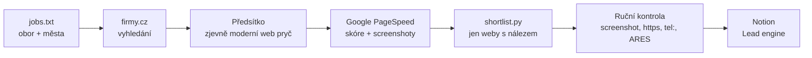

# Lead systém

Najde firmy v oboru, ověří jejich web přes Google a vybere ty, kterým má smysl volat. Výsledek jde do Notionu (Lead engine) jako lead s textem **Proč volám**, **Co nabízím** a **Důkaz**.



Výtěžnost je kolem **5 %**: z 60 firem v oboru vyjdou 2–5 leady. Zbytek má web v pořádku.

## Co je potřeba

- Node 20+ a `npm install` (Playwright s Chromiem).
- **Google PageSpeed Insights API klíč** v proměnné `PSI_API_KEY`. Klíč nikdy nepatří do repa. Založíš ho v Google Cloud Console → APIs & Services → Credentials → Create credentials → API key.
- Volitelně `CHROMIUM_PATH`, když Chromium neleží na výchozí cestě cloudového kontejneru.

## Jak to pustit

```bash
cd tools/lead-system
npm install
export PSI_API_KEY=...        # nikam neukládat do repa

cp jobs.example.txt jobs.txt  # upravit obory a města
./queue.sh                    # 3 obory najednou, ~40 min na obor
./repsi.sh                    # přeměří weby, kde PSI selhalo (kvóta)
python3 shortlist.py          # vypíše weby s nálezem (R1?, HTTP?, R4, ERR?)
python3 shortlist.py C        # + kandidáti na známku C (bez tel: odkazu a formuláře)
node httpscheck.mjs www.firma.cz   # potvrdí, jestli https opravdu nefunguje
```

Formát `jobs.txt` (řádek = jeden běh):

```
slozka|Obor|dotaz 1;dotaz 2;dotaz 3
```

Menší města vychází líp. Na firmy.cz se nahoru dostávají firmy, které se o marketing starají, a ty mívají dobrý web.

## Soubory

| Soubor | Co dělá |
|---|---|
| `pipeline.mjs` | firmy.cz → detail firmy (JSON-LD) → předsítko → `verify2.mjs` → ARES |
| `verify2.mjs` | Měření z Google PSI (mobil + desktop, screenshoty) a statická fakta ze stránky |
| `httpscheck.mjs` | Pustí PSI na `https://` verzi – potvrdí nebo vyvrátí „Nezabezpečeno“ |
| `shortlist.py` | Projde všechny běhy a vypíše weby s nálezem. Přeskočí domény z `done_hosts.txt` |
| `cleanup.mjs` | Přeověří existující leady z Notionu (`cleanup.tsv`: id, web, obor) |
| `queue.sh`, `repsi.sh` | Fronta běhů a přeměření |
| `RULES.md` | Pravidla hodnocení, známky, texty a pasti, na které jsme narazili |

Lokální soubory, které do repa nejdou (jsou v `.gitignore`): `runs/`, `jobs.txt`, `done_hosts.txt`, `known_domains.txt`, `cleanup.tsv`. Obsahují seznamy firem a repo je veřejné.

## Proč se neměří „přímo“

Cloudový kontejner jde přes proxy. Ta vrací timeouty, chyby 502 a přepisuje certifikáty, které běžný návštěvník nevidí. Proto:

- rychlost, HTTPS a rozbité soubory **jen z Google PSI**,
- screenshoty **jen z PSI**,
- z vlastního Chromia jen statická fakta (viewport, formulář, `tel:` odkazy), a to jen když se stránka opravdu načetla.

Podrobnosti a pasti jsou v `RULES.md`.
