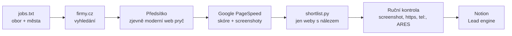
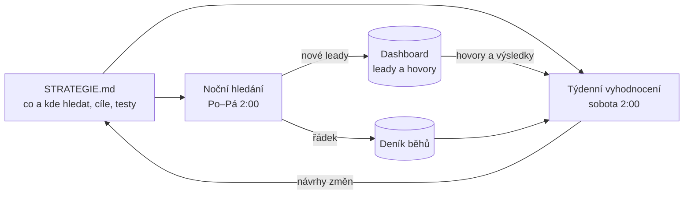

# Lead systém

Najde firmy v oboru, ověří jejich web přes Google a vybere ty, kterým má smysl volat. Výsledek jde do dashboardu (webkit.studio/dashboard, dřív Notion Lead engine) jako lead s textem **Proč volám**, **Co nabízím** a **Důkaz**.


```mermaid
flowchart LR
  A[jobs.txt<br>obor + města] --> B[firmy.cz<br>vyhledání]
  B --> C[Předsítko<br>zjevně moderní web pryč]
  C --> D[Google PageSpeed<br>skóre + screenshoty]
  D --> E[shortlist.py<br>jen weby s nálezem]
  E --> F[Ruční kontrola<br>screenshot, https, tel:, ARES]
  F --> G[Notion<br>Lead engine]
```

Výtěžnost je kolem **5 %**: z 60 firem v oboru vyjdou 2–5 leady. Zbytek má web v pořádku.

## Rutiny

Systém běží sám v jedné rutině **„Webkit · lead engine (Po–Pá hledání, So vyhodnocení)“** v cloudovém prostředí **Webkit.Studio**:

- **pondělí až pátek ve 2:00** noční hledání,
- **v sobotu ve 2:00** týdenní vyhodnocení.

Výsledek přijde e-mailem.

**Rutina v sobě instrukce nemá.** Při každém běhu si stáhne tohle repo a podle dne otevře jeden ze souborů níž. Strategie se tak mění úpravou souboru, ne rutiny.


```mermaid
flowchart LR
  S[STRATEGIE.md<br>co a kde hledat, cíle, testy] --> N
  S --> T
  N[Noční hledání<br>Po–Pá 2:00] -->|nové leady| L[(Dashboard<br>leady a hovory)]
  N -->|řádek| D[(Deník běhů)]
  L -->|hovory a výsledky| T[Týdenní vyhodnocení<br>sobota 2:00]
  D --> T
  T -->|návrhy změn| S
```

| Soubor | Kdo ho čte | Kdy ho měnit |
|---|---|---|
| `STRATEGIE.md` | obě rutiny | **Tady se mění strategie:** obory, města, cíle, testy, kam zapisovat. |
| `RULES.md` | noční hledání | Když se změní, co je důvod k hovoru a jak psát texty. |
| `rutiny/nocni-hledani.md` | noční hledání | Postup krok za krokem. Mění se zřídka. |
| `rutiny/tydenni-vyhodnoceni.md` | sobotní vyhodnocení | Co se počítá a jak vypadá vyhodnocení. |
| `rutiny/vystup-notion.md`, `rutiny/vystup-dashboard.md` | obě rutiny | Jak zapisovat a číst. Který platí, určuje `výstup` ve `STRATEGIE.md`. |

**Jak změnit strategii:** uprav `STRATEGIE.md` na větvi `main`. Úprava platí od dalšího běhu. Můžeš ji udělat přímo na GitHubu, nebo napsat Claudovi, co chceš změnit. Každou změnu zapiš do Historie změn na konci souboru.

**Jak zkusit jinou strategii (větev):**
1. Založ větev, třeba `strategie/mala-mesta`, a uprav v ní `STRATEGIE.md`.
2. V promptu rutiny přepiš `větev: main` na název nové větve.
3. Zpátky jde stejně, vrácením na `main`.

**Dashboard (od 30. 9. 2026):** rutiny zapisují leady a čtou hovory z dashboardu. Token je v prostředí Webkit.Studio jako `WKD_TOKEN`. Zpátky do Notionu se přepne změnou `výstup` na `notion` ve `STRATEGIE.md`.

Leady, které přibudou v Notionu ručně, převede do dashboardu skript `scripts/import-leady-notion.mjs` v repu dashboardu (nepřepíše leady, na kterých se v dashboardu pracuje).

Co musí dashboard ještě umět, je v `rutiny/vystup-dashboard.md`.

## Klíč PSI

**PSI = Google PageSpeed Insights.** Je to bezplatná služba Googlu, která web změří a vyfotí na mobilu i počítači. Systém se jí ptá na každý web, který prověřuje.

**Klíč** je dlouhý kód začínající `AIza…`. Google podle něj pozná, kdo se ptá. Bez klíče pustí jen pár měření a pak odmítá. S klíčem je zdarma 25 000 dotazů denně. Umí jen měřit weby, k ničemu jinému v Google účtu nepustí.

**Kde ho najdeš:** [console.cloud.google.com](https://console.cloud.google.com) → vlevo nahoře vyber projekt → APIs & Services → **Credentials** → řádek API key → **Show key**. Když tam žádný není, vytvoříš ho na [developers.google.com/speed/docs/insights/v5/get-started](https://developers.google.com/speed/docs/insights/v5/get-started) tlačítkem **Get a Key**.

**Kam ho dát:** do prostředí, ve kterém rutiny běží. Nikdy do repa ani do promptu rutiny.
1. Otevři v Claude libovolnou session v prostředí **Webkit.Studio**.
2. V záhlaví klikni na název prostředí → **Edit**.
3. Do **Environment variables** přidej řádek `PSI_API_KEY=AIza…` (celý klíč).
4. Ulož. Další běh rutiny si ho vezme sám.

## Co je potřeba

- Node 20+ a `npm install` (Playwright s Chromiem).
- **Google PageSpeed Insights API klíč** v proměnné `PSI_API_KEY`. Klíč nikdy nepatří do repa. Založíš ho v Google Cloud Console → APIs & Services → Credentials → Create credentials → API key.
- Volitelně `CHROMIUM_PATH`, když Chromium neleží na výchozí cestě cloudového kontejneru.

## Jak to pustit

```bash
cd tools/lead-system
npm install
export PSI_API_KEY=...        # nikam neukládat do repa

cp jobs.example.txt jobs.txt  # upravit obory a města
./queue.sh                    # 3 obory najednou, ~40 min na obor
SKIP=5 ./queue.sh             # přeskočí top 5 na firmy.cz – ty obvolává každý
SKIP=5 ./beh.sh rekonstrukce "Rekonstrukce bytů a domů" "rekonstrukce bytů Kolín;rekonstrukce bytů Tábor"   # celý běh jednoho oboru
./repsi.sh                    # přeměří weby, kde PSI selhalo (kvóta)
python3 shortlist.py          # vypíše weby s nálezem (R1?, HTTP?, R4, ERR?, SPAM)
python3 shortlist.py C        # + kandidáti na známku C (bez tel: odkazu a formuláře)
node httpscheck.mjs www.firma.cz   # potvrdí, jestli https opravdu nefunguje
node sheet.mjs shortlist.json runs/prehled   # screenshoty 10 na list, rychlá vizuální kontrola
```

Formát `jobs.txt` (řádek = jeden běh):

```
slozka|Obor|dotaz 1;dotaz 2;dotaz 3
```

Menší města vychází líp. Na firmy.cz se nahoru dostávají firmy, které se o marketing starají, a ty mívají dobrý web.

**Pozor na přeplněnou špičku.** Firmy na prvních místech Firmy.cz s webem nepřizpůsobeným pro mobil obvolávají i jiné agentury a AI nástroje. Dvě firmy hned první den řekly, že jim kvůli webu volal už někdo jiný. Proto `SKIP=5`: bere se 6.–12. místo.

## Soubory

| Soubor | Co dělá |
|---|---|
| `beh.sh` | Celý běh pro jeden obor jedním příkazem: hledání, měření, přeměření, shortlist, přehled screenshotů |
| `pipeline.mjs` | firmy.cz → detail firmy (JSON-LD) → předsítko → `verify2.mjs` → ARES |
| `chrome.mjs` | Najde Chromium (`CHROMIUM_PATH`, jinak `/opt/pw-browsers`) |
| `verify2.mjs` | Měření z Google PSI (mobil + desktop, screenshoty) a statická fakta ze stránky |
| `httpscheck.mjs` | Pustí PSI na `https://` verzi – potvrdí nebo vyvrátí „Nezabezpečeno“ |
| `shortlist.py` | Projde všechny běhy a vypíše weby s nálezem. Přeskočí domény z `done_hosts.txt` |
| `sheet.mjs` | Složí mobilní screenshoty ze shortlistu do přehledových obrázků (10 na list) |
| `cleanup.mjs` | Přeověří existující leady z Notionu (`cleanup.tsv`: id, web, obor) |
| `queue.sh`, `repsi.sh` | Fronta běhů a přeměření |
| `RULES.md` | Pravidla hodnocení, známky, texty a pasti, na které jsme narazili |
| `STRATEGIE.md` | Co, kde a proč hledat, cíle trychtýře, testy, rozhodovací pravidla, nastavení rutin |
| `rutiny/` | Postupy nočního hledání a týdenního vyhodnocení a jak zapisovat do Notionu a dashboardu |

Lokální soubory, které do repa nejdou (jsou v `.gitignore`): `runs/`, `jobs.txt`, `done_hosts.txt`, `known_domains.txt`, `cleanup.tsv`. Obsahují seznamy firem a repo je veřejné.

## Proč se neměří „přímo“

Cloudový kontejner jde přes proxy. Ta vrací timeouty, chyby 502 a přepisuje certifikáty, které běžný návštěvník nevidí. Proto:

- rychlost, HTTPS a rozbité soubory **jen z Google PSI**,
- screenshoty **jen z PSI**,
- z vlastního Chromia jen statická fakta (viewport, formulář, `tel:` odkazy), a to jen když se stránka opravdu načetla.

Podrobnosti a pasti jsou v `RULES.md`.
